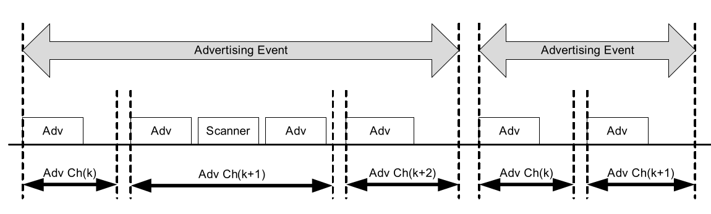
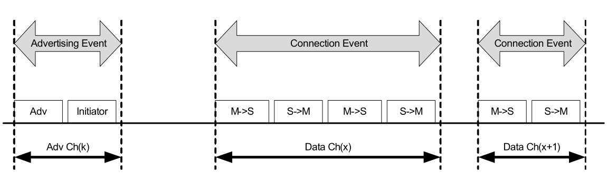
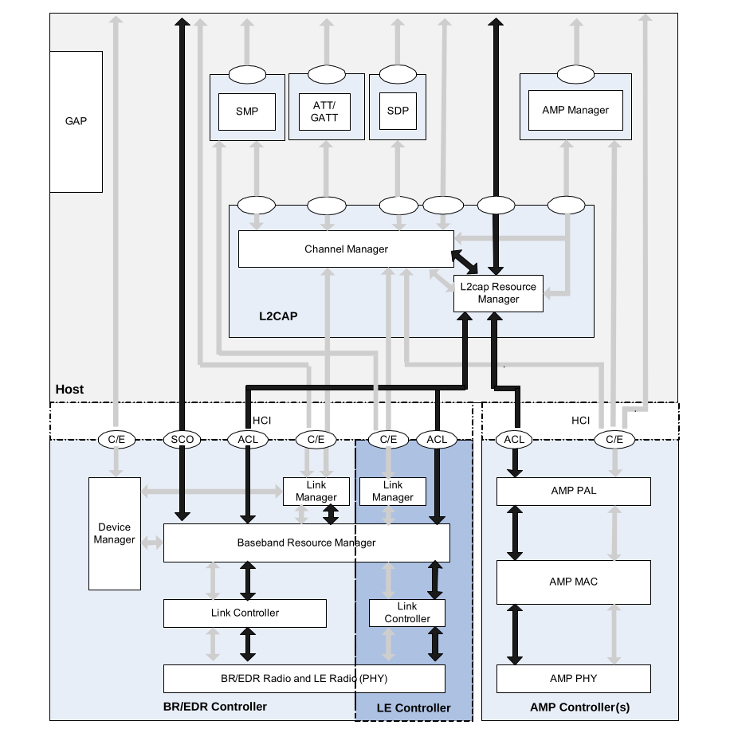
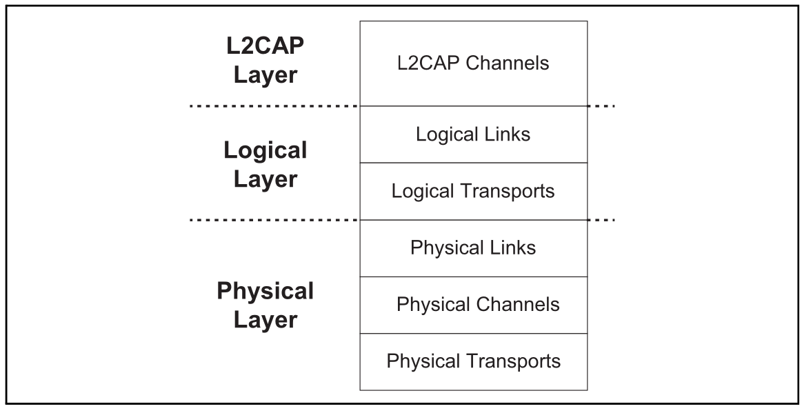
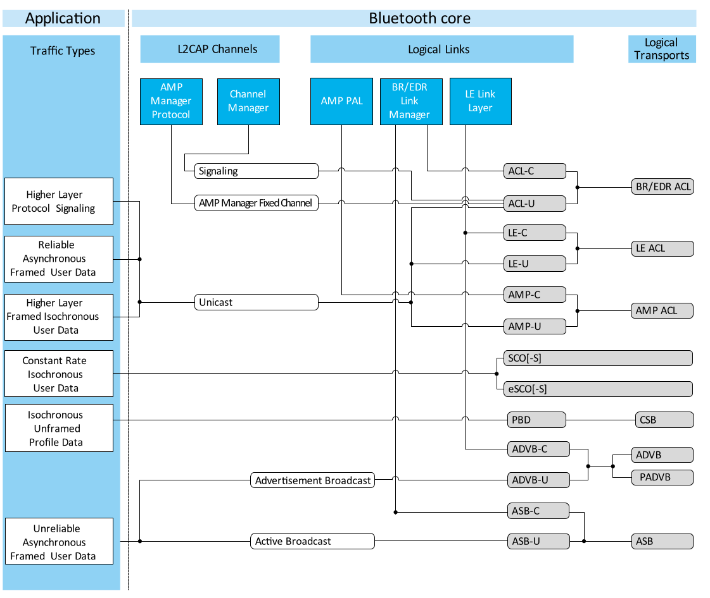
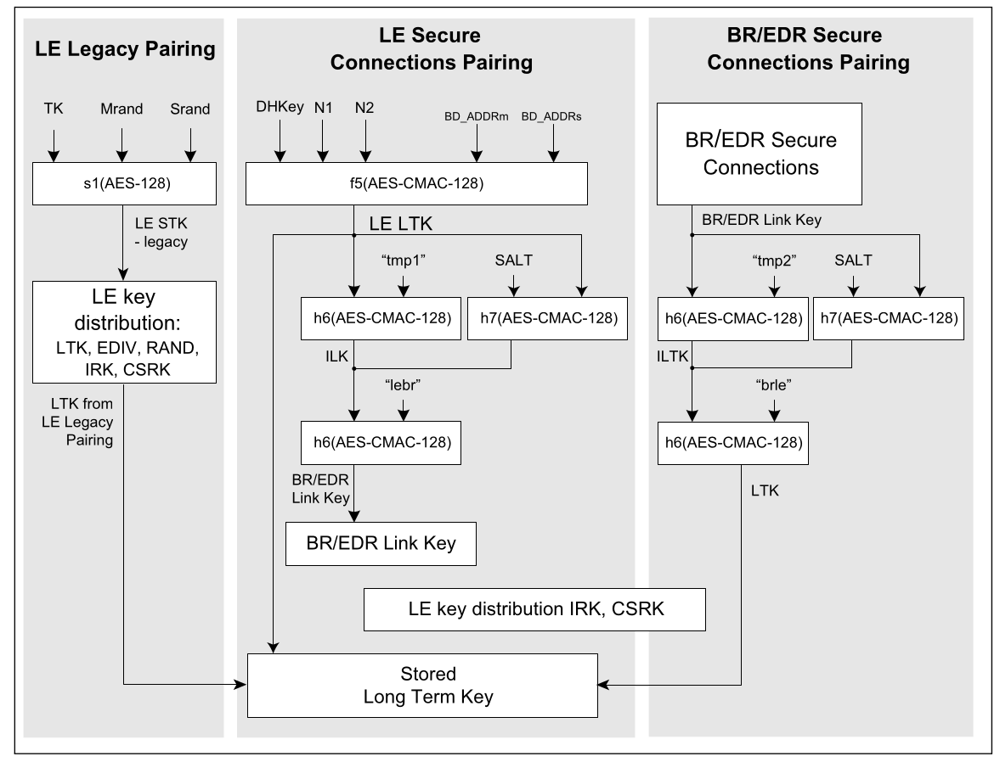

# ARCHITECTURE

------

## INTRODUCTION

Bluetooth wireless technology is a short-range communications system intended to replace the cable(s) connecting portable and/or fixed electronic devices. The key features of Bluetooth wireless technology are robustness, low power consumption, and low cost. Many features of the core specification are optional, allowing product differentiation.

There are two forms of Bluetooth wireless technology systems: Basic Rate (BR) and Low Energy (LE). Both systems include device discovery, connection establishment and connection mechanisms. The Basic Rate system includes optional Enhanced Data Rate (EDR) Alternate Media Access Control (MAC)
and Physical (PHY) layer extensions. The Basic Rate system offers synchronous and asynchronous connections with data rates of 721.2 kb/s for Basic Rate, 2.1 Mb/s for Enhanced Data Rate and high speed operation up to 54 Mb/s with the 802.11 AMP. The LE system includes features designed to enable products that require lower current consumption, lower complexity and lower cost than BR/EDR. The LE system is also designed for use cases and applications with lower data rates and has lower duty cycles. Depending on the use case or application, one system including any optional parts may be more optimal than the other.

The Bluetooth core system consists of a Host and one or more Controllers. A Host is a logical entity defined as all of the layers below the non-core profiles and above the Host Controller Interface (HCI). A Controller is a logical entity defined as all of the layers below HCI. An implementation of the Host and Controller may contain the respective parts of the HCI. Two types of Controllers are defined in this version of the Core Specification: Primary Controllers and Secondary Controllers.

------

## OVERVIEW OF BLUETOOTH LOW ENERGY

Like the BR/EDR radio, the LE radio operates in the unlicensed 2.4 GHz ISM band. The LE system employs a frequency hopping transceiver to combat
interference and fading and provides many FHSS carriers. LE radio operation uses a shaped, binary frequency modulation to minimize transceiver complexity.

The mandatory symbol rate is 1 megasymbol per second (Msym/s), where 1 symbol represents 1 bit therefore supporting a bit rate of 1 megabit per second (Mb/s), which is referred to as the LE 1M PHY.

The 1 Msym/s symbol rate may optionally support error correction coding, which is referred to as the LE Coded PHY. This may use either of two
coding schemes: S=2, where 2 symbols represent 1 bit therefore supporting a bit rate of 500 kb/s, and S=8, where 8 symbols represent 1 bit therefore supporting a bit rate of 125 kb/s.

An optional symbol rate of 2 Msym/s may be supported, with a bit rate of 2 Mb/s, which is referred to as the LE 2M PHY. The 2 Msym/s symbol rate supports uncoded data only. LE 1M and LE 2M are collectively referred to as the LE Uncoded PHYs.

LE employs two multiple access schemes: Frequency division multiple access (FDMA) and time division multiple access (TDMA). Forty (40) physical
channels, separated by 2 MHz, are used in the FDMA scheme. Three (3) are used as primary advertising channels and 37 are used as secondary advertising channels and as data channels.

The physical channel is sub-divided into time units known as events. Data is transmitted between LE devices in packets that are positioned in these events. There are four types of events: Advertising, Extended Advertising, Periodic Advertising, and Connection events.

Devices that transmit advertising packets on the advertising PHY channels are referred to as advertisers. Devices that receive advertising packets on the advertising channels without the intention to connect to the advertising device are referred to as scanners.

Devices that need to form a connection to another device listen for connectable advertising packets. Such devices are referred to as initiators. If the advertiser is using a connectable advertising event, an initiator may make a connection request using the same advertising PHY channel on which it received the connectable advertising packet.

Once a connection is established, the initiator becomes the master device in what is referred to as a piconet and the advertising device becomes the slave device. Connection events are used to send data packets between the master and slave devices.

------

## CORE SYSTEM ARCHITECTURE

The Bluetooth Core system consists of a Host, a Primary Controller and zero or more Secondary Controllers. A minimal implementation of the Bluetooth BR/EDR core system covers the four lowest layers and associated protocols defined by the Bluetooth specification as well as one common service layer protocol; the Service Discovery Protocol (SDP) and the overall profile requirements are specified in the Generic Access Profile (GAP). The BR/EDR Core system includes support of Alternate MAC/PHYs (AMPs) including an AMP Manager Protocol and Protocol Adaptation Layers (PALs) supporting externally referenced MAC/PHYs. A minimal implementation of a Bluetooth LE only core system covers the four lowest layers and associated protocols defined by the Bluetooth specification as well as two common service layer protocols; the Security Manager (SM) and Attribute Protocol (ATT) and the overall profile requirements are specified in the Generic Attribute Profile(GATT) and Generic Access Profile (GAP). Implementations combining Bluetooth BR/EDR and LE include both of the minimal implementations described above.

#### L2CAP Resource Manager

The L2CAP resource manager block is responsible for managing the ordering of submission of PDU fragments to the baseband and some relative scheduling between channels to ensure that L2CAP channels with QoS commitments are not denied access to the physical channel due to Controller resource exhaustion. This is required because the architectural model does not assume that a Controller has limitless buffering, or that the HCI is a pipe of infinite bandwidth.

L2CAP Resource Managers may also carry out traffic conformance policing to ensure that applications are submitting L2CAP SDUs within the bounds of their negotiated QoS settings. The general Bluetooth data transport model assumes well-behaved applications, and does not define how an implementation is expected to deal with this problem.

#### Security Manager Protocol

The Security Manager Protocol (SMP) is the peer-to-peer protocol used to generate encryption keys and identity keys. The protocol operates over a dedicated fixed L2CAP channel. The SMP block also manages storage of the encryption keys and identity keys and is responsible for generating random addresses and resolving random addresses to known device identities. The SMP block interfaces directly with the Controller to provide stored keys used for encryption and authentication during the encryption or pairing procedures.

This block is only used in LE systems. Similar functionality in the BR/EDR system is contained in the Link Manager block in the Controller. SMP functionality is in the Host on LE systems to reduce the implementation cost of the LE only Controllers.

#### Attribute Protocol

The Attribute Protocol (ATT) block implements the peer-to-peer protocol between an attribute server and an attribute client. The ATT client communicates with an ATT server on a remote device over a dedicated fixed L2CAP channel. The ATT client sends commands, requests, and confirmations to the ATT server. The ATT server sends responses, notifications and indications to the client. These ATT client commands and requests provide a means to read and write values of attributes on a peer device with an ATT server.

#### Generic Attribute Profile

The Generic Attribute Profile (GATT) block represents the functionality of the attribute server and, optionally, the attribute client. The profile describes the hierarchy of services, characteristics and attributes used in the attribute server. The block provides interfaces for discovering, reading, writing and indicating of service characteristics and attributes. GATT is used on LE devices for LE profile service discovery.

#### Generic Access Profile

The Generic Access Profile (GAP) block represents the base functionality common to all Bluetooth devices such as modes and access procedures used by the transports, protocols and application profiles. GAP services include device discovery, connection modes, security, authentication, association models and service discovery.

------

## DATA TRANSPORT ARCHITECTURE

The Bluetooth data transport system follows a layered architecture. This description of the Bluetooth system describes the Bluetooth core transport layers up to and including L2CAP channels.

For efficiency and legacy reasons, the Bluetooth transport architecture includes a sub-division of the logical layer, distinguishing between logical links
and logical transports. This sub-division provides a general (and commonly understood) concept of a logical link that provides an independent transport between two or more devices. The logical transport sub-layer is required to describe the inter-dependence between some of the logical link types (mainly for reasons of legacy behavior).

------

## CORE TRAFFIC BEARERS

The Bluetooth core system provides a number of standard traffic bearers for the transport of service protocol and application data.

The logical links are named using the names of the associated logical transport and a suffix that indicates the type of data that is transported. (C for control links carrying LMP or LL messages, U for L2CAP links carrying user data (L2CAP PDUs) and S for stream links carrying unformatted synchronous or isochronous data.) 

LE system should be considered inherently unreliable. To counteract this, the system provides levels of protection at each layer. The LL packet uses a 24-bit cyclic redundancy error check (CRC) to cover the contents of the packet payload. If the CRC verification fails on the packet payload, the packet is not acknowledged by the receiver and the packet gets retransmitted by the sender.

Broadcast links have no feedback route, and are unable to use the acknowledgment scheme (although the receiver is still able to detect errors in received packets). Instead, each packet is transmitted several times to increase the probability that the receiver is able to receive at least one of the copies successfully. Despite this approach there are still no guarantees of successful receipt, and so these links are considered unreliable.

------

## PHYSICAL CHANNELS

In the LE core system, two Bluetooth devices use a shared physical channel for communication. To achieve this, their transceivers need to be tuned to the same PHY frequency at the same time, and they need to be within a nominal range of each other.

Three LE physical channels are defined. Each is optimized and used for a different purpose. The LE piconet channel is used for communication between connected devices and is associated with a specific piconet. The LE advertising channel is used for broadcasting advertisements to LE devices. These advertisements can be used to discover, connect, or send user data to scanner or initiator devices. The periodic physical channel is used to send user data to scanner devices in periodic advertisements at a specified interval.

#### LE Piconet Channel

The LE piconet channel is used for communication between connected LE devices during normal operation.

The LE piconet channel is characterized by a pseudo-random sequence of PHY channels and by three additional parameters provided by the master. The first is the channel map that indicates the set of PHY channels used in the piconet. The second is a pseudo random number used as an index into the complete set of PHY channels. The third is the timing of the first data packet sent by the master after the connection request.

The channel is divided into connection events where each connection event corresponds to a PHY hop channel. Consecutive connection events correspond to different PHY hop channels. The first packet sent by the master after the connection establishment sets an anchor point for the timing of all future connection events. In a connection event the master transmits packets to a slave in the piconet and the slave may or may not respond with a packet of its own.

There are 37 LE piconet channels. The master can reduce this number through the channel map indicating the used channels. When the hopping pattern hits an unused channel the unused channel is replaced with an alternate from the set of used channels. The LE Piconet physical channel can use any LE PHY.

#### Advertising Channels

An LE advertising channel is used to set up connections between two devices or to communicate broadcast information between unconnected devices.

The primary advertising channel is a set of three fixed PHY channels spread evenly across the LE frequency spectrum. The number of primary advertising
PHY channels can be reduced by the advertising device in order to reduce interference. The primary advertising channel can use either the LE 1M or LE Coded PHY.

The primary advertising channel is divided into advertising events where each advertising event can hop on all three advertising PHY channels. Consecutive advertising events begin on the first advertising PHY channel. The advertising events occur at regular intervals which are slightly modified with a random delay to aid in interference avoidance.

The secondary advertising channel is a set of 37 fixed PHY channels spread across the LE frequency spectrum. These are the same fixed LE PHY channels used by the data channel. The secondary advertising channel uses the same channel indices as the data channel. The payload of advertising packets used on the secondary advertising channel can vary in length from 0 to 255 octets. Advertising packets on the secondary advertising channel are not part of the advertising event but are part of the extended advertising event. These extended advertising events begin at the same time as the advertising event on the primary advertising channel and conclude with the last packet on the secondary advertising channel.

The secondary advertising channel is used to offload data that would otherwise be transmitted on the primary advertising channel. Advertising packets on the secondary advertising channel ("auxiliary packets") are scheduled by the advertiser when sufficient over-the-air time is available. The advertising packet on the primary advertising channel contains the PHY channel and the offset to the start time of the auxiliary packet.

#### Periodic Physical Channel

An LE periodic physical channel is used to set up a periodic broadcast between unconnected devices.

The periodic physical channel is characterized by a pseudo-random sequence of PHY channels and additional parameters provided by the advertiser. These are the channel map that indicates the set of PHY channels used in the periodic broadcast, the event counter used to determine the channel hopping sequence, the offset indicating the timing of the first periodic broadcast packet, and the interval between successive periodic broadcasts.

The channel is divided into periodic advertising events where the start of a periodic advertising event corresponds to a PHY hop channel. The start of consecutive periodic advertising events corresponds to different PHY hop channels. The first packet sent by the advertiser after the broadcast is established sets an anchor point for the timing of all future periodic advertising events.

Each advertiser transmission contains a packet carrying information on the PADVB logical transports. Scanners cannot transmit on the physical channel. There are 37 PHY channels. The advertiser can reduce this number through the channel map indicating the used channels. When the hopping pattern hits an unused channel, the unused channel is replaced with an alternate from the set of used channels. The periodic physical channel can use any PHY. 

All periodic advertising events use the same PHY used by the advertiser in the packet describing the characteristics of the periodic physical channel.

------

## PHYSICAL LINKS

A physical link represents a baseband connection between Bluetooth devices. A physical link is always associated with exactly one physical channel (although a physical channel may support more than one physical link). Within the Bluetooth system a physical link is a virtual concept that has no direct representation within the structure of a transmitted packet.

Some physical link types have properties that may be modified. An example of this is the transmit power for the link. Other physical link types have no modifiable properties.

The LE piconet physical channels support an LE active physical link. 

The physical link is a point-to-point link between the master and a slave. It is always present when the slave is in a connection with the master.

The LE advertising physical channels support an LE advertising physical link. The physical link is a broadcast between the advertiser device and one or more scanner or initiator devices. It is always present when the advertiser is broadcasting advertisement events.

The LE periodic physical channels support an LE periodic physical link. The physical link is a broadcast between the advertiser device and one or more scanner devices. It is always present when the advertiser is broadcasting periodic advertising events.

------

## LOGICAL LINKS AND LOGICAL TRANSPORTS

A variety of logical links are available to support different application data transport requirements. Each logical link is associated with a logical transport, which has a number of characteristics. These characteristics include flow control, acknowledgment/repeat mechanisms, sequence numbering and scheduling behavior.

Logical transports are able to carry different types of logical links (depending on the type of the logical transport). In the case of some of the Bluetooth logical links these are multiplexed onto the same logical transport. Logical transports may be carried by active physical links on either the basic or the adapted piconet physical channel.

Logical transport identification and real-time (link control) signaling are carried in the packet header, and for some logical links identification is carried in the payload header.

#### LE Asynchronous Connection (LE ACL)

The LE asynchronous connection (LE ACL) logical transport is used to carry LL and L2CAP control signaling and best effort asynchronous user data. The LE ACL logical transport uses a 1-bit NESN/SN scheme to provide simple channel reliability. Every active slave device within an LE piconet has one LE ACL logical transport to the piconet master, known as the default LE ACL.

#### LE Advertising Broadcast (ADVB)

The LE advertising broadcast logical transport is used to transport broadcast control and user data to all scanning devices in a given area. There is no acknowledgment protocol and the traffic is predominately unidirectional from the advertising device. A scanning device can send requests over the logical transport to get additional broadcast user data, or to form an LE ACL logical transport connection. The LE Advertising Broadcast logical transport data is carried only over the LE advertising broadcast link.

The ADVB logical transport is inherently unreliable because of the lack of acknowledgment. To improve the reliability, each packet is transmitted a number of times over the LE advertising broadcast link.

#### LE Periodic Advertising Broadcast (PADVB)

The LE periodic advertising broadcast logical transport is used to transport periodic broadcast control and user data to all scanning devices in a given area. The data may be constant for several periods or may change frequently. There is no acknowledgment protocol and the traffic is unidirectional from the dvertising device. The LE Periodic Advertising Broadcast logical transport data is carried only over the LE periodic physical link.

The PADVB logical transport is inherently unreliable because of the lack of acknowledgment. To improve the reliability, the period between transmissions can be shorter than the interval between changes to the data so that each packet can be transmitted a number of times over the LE periodic physical link.

------

## LE Procedures

#### Device Filtering Procedure

The device filtering procedure is a method for Controllers to reduce the number of devices requiring communication responses. Since it is not required to respond to requests from every device, it reduces the number of transmissions an LE Controller is required to make which reduces power consumption. It also reduces the communication the Controller would be required to make with the Host. This results in additional power savings since the Host does not have to be involved.

#### Advertising Procedure

An advertiser uses the advertising procedure to perform unidirectional broadcasts to devices in the area. The unidirectional broadcast occurs without a connection between the advertising device and the listening devices. The advertising procedure can be used to establish connections with nearby initiating devices or used to provide periodic broadcast of user data to scanning devices listening on the advertising channel. The advertising procedure uses the primary advertising channel for all advertising broadcasts. However, the data may be offloaded on to the secondary advertising channel in one or more auxiliary packets to reduce both the occupancy of the primary advertising channel and the total on-air time and also to allow the data to be longer than the maximum that will fit into a single packet.

#### Scanning Procedure

A scanning device uses the scanning procedure to listen for unidirectional broadcasts of user data from advertising devices using the advertising channel. A scanning device can request additional user data from an advertising device by making a scan request. The advertising device responds to these requests with additional user data sent to the scanning device over the advertising channel.

#### Discovering Procedure

Bluetooth devices use the advertising procedure and scanning procedure to discover nearby devices, or to be discovered by devices in a given area. The discovery procedure is asymmetrical. A Bluetooth device that tries to find other nearby devices is known as a discovering device and listens for devices advertising scannable advertising events. Bluetooth devices that are available to be found are known as discoverable devices and actively broadcast scannable advertising events over the advertising broadcast physical channel.

#### Connecting Procedure

The procedure for forming connections is asymmetrical and requires that one Bluetooth device carries out the advertising procedure while the other Bluetooth device carries out the scanning procedure. The advertising procedure can be targeted, so that only one device will respond to the advertising. The scanning device can also target an advertising device by first discovering that the advertising device is present in a connectable manner, and in the given area, and then scanning only connectable advertising events from that device using the device filter. After receiving connectable advertising events from the targeted advertising device, it can initiate a connection by sending the connection request to the targeted advertising device over the primary advertising channel or secondary advertising channel.

#### Periodic Advertising Procedure

An advertiser uses the periodic advertising procedure to perform unidirectional periodic broadcasts to devices in the area. The unidirectional broadcast occurs without a connection between the advertising device and the listening devices. The periodic advertising procedure can be used to synchronize with nearby devices to provide deterministic periodic broadcast of user data to scanning devices listening on the advertising channel. The advertising procedure uses the primary and secondary advertising channel to broadcast control and user information about the periodic advertising.

#### Periodic Advertising Synchronization Procedure

The procedure for synchronizing to periodic advertising is asymmetrical and requires that one Bluetooth device carries out the advertising procedure while the other Bluetooth device carries out the scanning procedure. The scanning device can target an advertising device by first discovering that the advertising device is present and broadcasting periodic advertisements in the given area. After receiving advertising events containing synchronization information from the targeted advertising device, it can synchronize to the periodic advertising events.

------

## SECURITY OVERVIEW

The Bluetooth security model includes five distinct security features: pairing, bonding, device authentication, encryption and message integrity.

- Pairing: the process for creating one or more shared secret keys
- Bonding: the act of storing the keys created during pairing for use in subsequent connections in order to form a trusted device pair
- Device authentication: verification that the two devices have the same keys
- Encryption: message confidentiality
- Message integrity: protects against message forgeries

The security key hierarchy for LE is shown. The key hierarchy is different depending on whether a physical link is using LE Secure Connections or LE legacy pairing procedures and algorithms.

#### Numeric Comparison

The Numeric Comparison association model is designed for scenarios where both devices are capable of displaying a six digit number and both are capable of having the user enter "yes" or "no". A good example of this model is the cell phone / PC scenario.

#### Just Works

The Just Works association model is primarily designed for scenarios where at least one of the devices does not have a display capable of displaying a six digit number nor does it have a keyboard capable of entering six decimal digits. A good example of this model is the cell phone/mono headset scenario where most headsets do not have a display.

The Just Works association model uses the Numeric Comparison protocol but the user is never shown a number and the application may simply ask the user to accept the connection (exact implementation is up to the end product manufacturer).

#### Passkey Entry

The Passkey Entry association model is primarily designed for the scenario where one device has input capability but does not have the capability to display six digits and the other device has output capabilities. A good example of this model is the PC and keyboard scenario.

#### Out of Band

The Out of Band (OOB) association model is primarily designed for scenarios where an Out of Band mechanism is used to both discover the devices as well as to exchange or transfer cryptographic numbers used in the pairing process. In order to be effective from a security point of view, the Out of Band channel should provide different properties in terms of security compared to the Bluetooth radio channel. The Out of Band channel should be resistant to MITM attacks. If it is not, security may be compromised during authentication.

------

## BLUETOOTH APPLICATION ARCHITECTURE

Application interoperability in the Bluetooth system is accomplished by Bluetooth profiles. Bluetooth profiles define the required functions and features of each layer in the Bluetooth system from the PHY to L2CAP and any other protocols outside of the Core specification. The profile defines the vertical interactions between the layers as well as the peer-to-peer interactions of specific layers between devices.

#### GENERIC ACCESS PROFILE

The Bluetooth system defines a base profile which all Bluetooth devices implement. This profile is the Generic Access Profile (GAP), which defines the basic requirements of a Bluetooth device.

LE, it defines the Physical Layer, Link Layer, L2CAP, Security Manager, Attribute Protocol and Generic Attribute Profile. This ties all the various layers together to form the basic requirements for a Bluetooth device. It also describes the behaviors and methods for device discovery, connection establishment, security, authentication, association models and service discovery.

In LE, GAP defines four specific roles: Broadcaster, Observer, Peripheral, and Central. A device may support multiple LE GAP roles provided that the underlying Controller supports those roles or role combinations. Each role specifies the requirements for the underlying Controller. This allows for Controllers to be optimized for specific use cases.

#### GENERIC ATTRIBUTE PROFILE

Generic Attribute Profile (GATT) is built on top of the Attribute Protocol (ATT) and establishes common operations and a framework for the data transported and stored by the Attribute Protocol. GATT defines two roles: Server and Client. The GATT roles are not necessarily tied to specific GAP roles and but may be specified by higher layer profiles. GATT and ATT are not transport specific and can be used in both BR/EDR and LE. However, GATT and ATT are mandatory to implement in LE since it is used for discovering services

The GATT server stores the data transported over the Attribute Protocol and accepts Attribute Protocol requests, commands and confirmations from the GATT client. The GATT server sends responses to requests and when configured, sends indication and notifications asynchronously to the GATT client when specified events occur on the GATT server.

- **Service** - A service is a collection of data and associated behaviors to accomplish a particular function or feature of a device or portions of a device. A service may reference other primary or secondary services and/or a set of characteristics that make up the service.
- **Referenced Services** - A referenced service is a method to incorporate another service definition on the server as part of the service referencing it. When a service references another service, the entire referenced service becomes part of the new service including any nested referenced services and characteristics. The referenced service still exists as an independent service. There are no limits to the depth of nested references.
- **Characteristic** -A characteristic is a value used in a service along with properties and configuration information about how the value is accessed and information about how the value is displayed or represented. A characteristic definition contains a characteristic declaration, characteristic properties, and a value. It may also contain descriptors that describe the value or permit configuration of the server with respect to the characteristic value.
