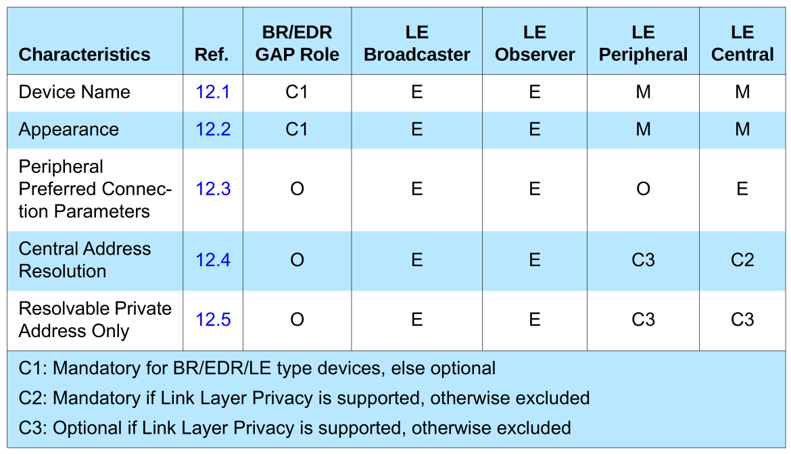

# GENERIC ACCESS PROFILE

------

## INTRODUCTION

This profile states the requirements on names, values and coding schemes used for names of parameters and procedures experienced on the user interface level.

This profile defines modes of operation that are not service- or profile-specific, but that are generic and can be used by profiles referring to this profile, and by devices implementing multiple profiles.

This profile defines the general procedures that can be used for discovering identities, names and basic capabilities of other Bluetooth devices that are in a mode where they can be discovered. Only procedures where no channel or connection establishment is used are specified.

This profile defines the general procedure for how to create bonds (i.e., dedicated exchange of link keys) between Bluetooth devices.

This profile describes the general procedures that can be used for establishing connections to other Bluetooth devices that are in a mode that allows them to accept connections and service requests.

The purpose of this profile is to describe:

- Profile roles
- Discoverability modes and procedures
- Connection modes and procedures
- Security modes and procedures

Roles when Operating over an LE Physical Transport:

- **Broadcaster Role** - A device operating in the Broadcaster role is a device that sends advertising
  events.
- **Observer Role** - A device operating in the Observer role is a device that receives advertising
  events.
- **Peripheral Role** - Any device that accepts the establishment of an LE active physical link using any of the connection establishment procedures is referred to as being in the Peripheral role. A device operating in the Peripheral role will be in the Slave role in the Link Layer Connection State. A device operating in the Peripheral role is referred to as a Peripheral.
- **Central Role** - A device that supports the Central role initiates the establishment of an LE active physical link. A device operating in the Central role will be in the Master role in the Link Layer Connection State. A device operating in the Central role is referred to as a Central.

------

## REPRESENTATION OF BLUETOOTH PARAMETERS

- **Bluetooth Device Address (BD_ADDR)** - A BD_ADDR is the address used by a Bluetooth device. It is received from a remote device during the device discovery procedure. When the Bluetooth address is referred to on UI level, the term **Bluetooth Device Address** should be used. On the baseband level the BD_ADDR is represented as 48 bits.
- **Bluetooth Device Name** - The Bluetooth device name is the user-friendly name that a Bluetooth device exposes to remote devices. For a device supporting the LE-only device type, the name is a character string held in the Device Name characteristic. When the Bluetooth device name is referred to on UI level, the term **Bluetooth Device Name** should be used.
- **Bluetooth Passkey (Bluetooth PIN)** - The Bluetooth passkey may be used to authenticate two Bluetooth devices with each other during the creation of a mutual link key via the pairing procedure. The passkey may be used in the pairing procedures to generate the initial link key. The PIN may be entered on the UI level but may also be stored in the device; e.g., in the case of a device without sufficient MMI for entering and displaying digits. When the Bluetooth PIN is referred to on UI level, the term **Bluetooth Passkey** should be used. For compatibility with devices with numeric keypads, fixed PINs shall be composed of only decimal digits, and variable PINs should be composed of only decimal digits.
- **Class of Device** - Class of device is a parameter received during the device discovery procedure on the BR/EDR physical transport, indicating the type of device. The Class of Device parameter is **only used on BR/EDR and BR/EDR/LE devices** using the BR/EDR physical transport.
- **Appearance Characteristic** - The Appearance characteristic contains a 16-bit number that can be mapped to an icon or string that describes the physical representation of the device during the device discovery procedure. It is a characteristic of the GAP service located on the device’s GATT server. The Appearance characteristic value should be mapped to an icon or string or something similar that conveys to the user a visual description of the device. This allows the user to determine which device is being discovered purely by visual appearance.

------

## OPERATIONAL MODES AND PROCEDURES – LE PHYSICAL TRANSPORT

Several different modes and procedures may be performed simultaneously over an LE physical transport. The following modes and procedures are defined for use over an LE physical transport:

- Broadcast mode and observation procedure
- Discovery modes and procedures
- Connection modes and procedures
- Bonding modes and procedures
- Periodic advertising modes and procedure

#### BROADCAST MODE AND OBSERVATION PROCEDURE

The broadcast mode and observation procedure allow two devices to communicate in a unidirectional connectionless manner using the advertising events.

The **broadcast mode** provides a method for a device to send connectionless data in advertising events. A device in the broadcast mode may send non-connectable and non- scannable undirected or nonconnectable and non-scannable directed advertising events anonymously by excluding the broadcaster's address.

The **observation procedure** provides a method for a device to receive connectionless data from a device that is sending advertising events. A device performing the observation procedure may use active scanning to also receive scan response data sent by any device in the broadcast mode that advertises using scannable advertising events.

#### DISCOVERY MODES AND PROCEDURES

All devices shall be in either non-discoverable mode or one of the discoverable modes. 

A device in the discoverable mode shall be in either the **general discoverable mode** or the limited discoverable mode. A device in the **non-discoverable mode** is not discoverable. 

Devices operating in either the general discoverable mode or the limited discoverable mode can be found by the discovering device.

- **Non-Discoverable Mode** - A device configured in non-discoverable mode will not be discovered by any device that is performing either the general discovery procedure or the limited discovery procedure.

- **Limited Discoverable Mode** - Devices configured in the limited discoverable mode are discoverable for a limited period of time by other devices performing the limited or general device discovery procedure. The limited discoverable mode is typically used when a user performs a specific action to make the device discoverable for a limited period of time. Devices shall remain in the limited discoverable mode no longer than **Tgap(lim_adv_timeout)**.

- **General Discoverable Mode** - Devices configured in general discoverable mode are intended to be discoverable by devices performing the general discovery procedure. The general discoverable mode is typically used when the device is intending to be discoverable for a long period of time.

  

- **Limited Discovery Procedure** - A device performing the limited discovery procedure receives the device address, advertising data and scan response data from devices in the limited discoverable mode only.

- **General Discovery Procedure** - A device performing the general discovery procedure receives the device address, advertising data and scan response data from devices in the limited discoverable mode or the general discoverable mode.

- **Name Discovery Procedure** - The name discovery procedure is used to obtain the Bluetooth Device Name of remote connectable device. If the complete device name is not acquired while performing either the limited discovery procedure or the general discovery procedure, then the name discovery procedure may be performed.

  

#### CONNECTION MODES AND PROCEDURES

The connection modes and procedures allow a device to establish a connection to another device.

When devices are connected, the parameters of the connection can be updated with the Connection Parameter Update procedure. The connected device may terminate the connection using the Terminate Connection procedure.

- **Non-Connectable Mode** - A device in the non-connectable mode shall not allow a connection to be established. A Peripheral device in the non-connectable mode may send non-connectable advertising events.
- **Directed Connectable Mode** - A device in the directed connectable mode shall accept a connection request from a known peer device performing the auto connection establishment procedure or the general connection establishment procedure. This mode shall only be used if the device has a known peer device address. A Peripheral device shall send connectable directed advertising events.
- **Undirected Connectable Mode** - A device in the undirected connectable mode shall accept a connection request from a device performing the auto connection establishment procedure or the general connection establishment procedure. Peripheral device shall send either connectable and scannable undirected advertising events or connectable undirected advertising events.

- **Auto Connection Establishment Procedure** - The auto connection establishment procedure allows the Host to configure the Controller to autonomously establish a connection with one or more devices in the directed connectable mode or the undirected connectable mode. White Lists in the Controller are used to store device addresses. This procedure uses the initiator White List in the Controller. The Controller autonomously establishes a connection with a device with the device address that matches the address stored in the White List.
- **General Connection Establishment Procedure** - The general connection establishment procedure allows the Host to establish a connection with a set of known peer devices in the directed connectable mode or the undirected connectable mode.
- **Selective Connection Establishment Procedure** - The selective connection establishment procedure allows the Host to establish a connection with the Host selected connection configuration parameters with a set of devices addresses in the White List. When the Host discovers one of the peer devices it is connecting to, the Host shall stop scanning, and initiate a connection using the direct connection establishment procedure with the connection configuration parameters for that peer device.
- **Direct Connection Establishment Procedure** - The direct connection establishment procedure allows the Host to establish a connection with the Host selected connection configuration parameters with a single peer device.
- **Connection Parameter Update Procedure** - The connection parameter update procedure allows a Peripheral or Central to update the Link Layer connection parameters of an established connection.
- **Terminate Connection Procedure** - The terminate connection procedure allows a Host to terminate the connection with a peer device.

------

## BONDING MODES AND PROCEDURES

Bonding allows two connected devices to exchange and store security and identity information to create a trusted relationship. When the devices store the bonding information, it is known as the phrases ‘devices have bonded’ or ‘a bond is created’.

There are two modes for bonding, non-bondable mode and bondable mode. Bonding may only occur between two devices in bondable mode.

- **Non-Bondable Mode** - A device in the non-bondable mode does not allow a bond to be created with a peer device. If a device does not support pairing as defined in the Security Manager section then it is considered to be in non-bondable mode.
- **Bondable Mode** - A device in the bondable mode allows a bond to be created with a peer device in the bondable mode. The Host shall set the Bonding_Flags to ‘Bonding’ during the pairing procedure.
- **Bonding Procedure** - The bonding procedure may be performed when a non-bonded device tries to access a service that requires bonding. The bonding procedure may be performed for the purpose of creating a bond between two devices. If the peer device is in the bondable mode, the devices shall exchange and store the bonding information in the security database.

------

## PERIODIC ADVERTISING MODES AND PROCEDURE

The periodic advertising modes and procedure allow two or more devices to communicate in a unidirectional connectionless manner using extended advertising events and periodic advertising events.

- **Periodic Advertising Synchronizability Mode** - The periodic advertising synchronizability mode provides a method for a device to send synchronization information about periodic advertising events. A device in the periodic advertising synchronizability mode shall send synchronization information for periodic advertising events in non-connectable and non-scannable extended advertising events.
- **Periodic Advertising Mode** - The periodic advertising mode provides a method for a device to send advertising data at periodic and deterministic intervals. A device in the periodic advertising mode shall send periodic advertising events at the interval and using the frequency hopping sequence specified in the periodic advertising synchronization information.
- **Periodic Advertising Synchronization Establishment Procedure** - The periodic advertising synchronization establishment procedure provides a method for a device to receive periodic advertising synchronization information and to synchronize to periodic advertisements. A device performing the periodic advertising synchronization establishment procedure shall scan for non-connectable and non-scannable advertising events containing synchronization information for periodic advertising events. When a device receives synchronization information for periodic advertising events, it may listen for periodic advertising events at the intervals and using the frequency hopping sequence specified in the synchronization information contained in the non-connectable and non-scannable extended advertising event.

------

## SECURITY ASPECTS – LE PHYSICAL TRANSPORT

#### LE SECURITY MODES

The security requirements of a device, a service or a service request are expressed in terms of a **security mode** and **security level**. There are two LE security modes, LE security mode 1 and LE security mode 2.

LE security **mode 1** has the following security levels:

- No security (No authentication and no encryption)
- Unauthenticated pairing with encryption
- Authenticated pairing with encryption
- Authenticated LE Secure Connections pairing with encryption using a 128- bit strength encryption key.

LE security **mode 2** has two security levels:

- Unauthenticated pairing with data signing
- Authenticated pairing with data signing

LE security mode 2 shall only be used for connection based data signing.

A device may be in a **Secure Connections Only** mode. When in Secure Connections Only mode only security mode 1 level 4 shall be used except for services that only require security mode 1 level 1.

#### AUTHENTICATION PROCEDURE

The authentication procedure describes how the required security is established when a device initiates a service request to a remote device and when a device receives a service request from a remote device. The authentication procedure covers LE security **mode 1**. The authentication procedure shall only be initiated after a connection has been established.

**Responding to a Service Request**

When a local device receives a service request from a remote device, it shall respond with an error code if the service request is denied. The error code is dependent on whether the current connection is encrypted or not and on the type of pairing that was performed to create the LTK or STK to be used. The local device will respond with the minimum security level required foraccess to its services.

**Handling of GATT Indications and Notifications**

A client “requests” a server to send indications and notifications by appropriately configuring the server via a Client Characteristic Configuration Descriptor. 

Since the configuration is persistent across a disconnection and reconnection, security requirements must be checked upon a reconnection before sending indications or notifications. When a server reconnects to a client to send an indication or notification for which security is required, the server shall initiate or request encryption with the client prior to sending an indication or notification. 

If the client does not have an LTK indicating that the client has lost the bond, enabling encryption will fail.

#### DATA SIGNING

The data signing is used for transferring authenticated data between two devices in an unencrypted connection. The data signing method is used by services that require fast connection set up and fast data transfer.

If a service request specifies LE security mode 2, the connection data signing procedure shall be used.

A device shall generate a new **Connection Signature Resolving Key** CSRK for each set of peer device(s) to which it sends signed data in connections.

If encryption is not required and CSRK is available (LE security mode 2) then the data signing procedure shall be used when making a service request involving a write operation.

If the link is encrypted and the server receives a request from a client for which the server requires data signing but does not require encryption, then the server shall complete the request if it is otherwise valid as the encrypted state of the link is considered to satisfy the signing requirement.

------

## PRIVACY FEATURE

Two modes of privacy exist:

- **Device Privacy Mode**: When a device is in device privacy mode, it is only concerned about its own privacy. It should accept advertising packets from peer devices that contain their identity addresses as well as their private address, even if the peer device has distributed its IRK. A device shall only use this mode when the Resolvable Private Address Only characteristic is not present in the GAP service of the peer device.
- **Network Privacy Mode**. When a device is in network privacy mode, it shallnot accept advertising packets containing the identity address of peer devices that have distributed their IRK.

The privacy-enabled Peripheral shall use a resolvable private address as the advertiser's device address when in connectable mode. A Peripheral shall use non-resolvable or resolvable private addresses when in non-connectable mode.

The Central shall use a resolvable private address as the initiator's device address. During active scanning, a privacy enabled Central shall use a non-resolvable or resolvable private address.

For the purposes of this profile, the random device address may be of either of the following two sub-types:

- **Static** address
- **Private** address.

The term random device address refers to both static and private address types.

The private address may be of either of the following two sub-types:

- **Non-resolvable** private address
- **Resolvable** private address

------

## GAP SERVICE AND CHARACTERISTICS FOR GATT SERVER

The GATT server shall contain the GAP service. A device shall have only one instance of the GAP service in the GATT server. The GAP service is a GATT based service with the service UUID as «GAP Service».

#### DEVICE NAME CHARACTERISTIC (0x2A00)

The Device Name characteristic shall contain the name of the device as an UTF-8 string.

When the device is discoverable, the Device Name characteristic value shall be readable without authentication or authorization. When the device is not discoverable, the Device Name Characteristic should not be readable without authentication or authorization.

The Device Name characteristic value shall be 0 to 248 octets in length. A device shall have only one instance of the Device Name characteristic.

#### APPEARANCE CHARACTERISTIC (0x2A01)

The Appearance characteristic defines the representation of the external appearance of the device. This enables the discovering device to represent the
device to the user using an icon, or a string, or similar. 

The Appearance characteristic value shall be readable without authentication or authorization.

The Appearance characteristic value shall be the enumerated value as defined by Bluetooth Assigned Numbers document. The Appearance characteristic value shall be 2 octets in length. A device shall have only one instance of the Appearance characteristic.

#### PERIPHERAL PREFERRED CONNECTION PARAMETERS CHARACTERISTIC (0x2A04)

The Peripheral Preferred Connection Parameters (PPCP) characteristic contains the preferred connection parameters of the Peripheral.

The Peripheral Preferred Connection Parameters characteristic value shall be readable. Authentication and authorization may be defined by a higher layer specification or be implementation specific.

The Peripheral Preferred Connection Parameters characteristic value shall be 8 octets in length. A device shall have only one instance of the Peripheral Preferred Connection Parameters characteristic.

The preferred connection parameters structured data is defined as follows:

- Minimum connection interval
- Maximum connection interval
- Slave latency
- Connection Supervision timeout multiplier

#### CENTRAL ADDRESS RESOLUTION (0x2AA6)

The Peripheral shall check if the peer device supports address resolution by reading the Central Address Resolution characteristic before using directed advertisement where the initiator address is set to a Resolvable Private Address (RPA).

The Central Address Resolution characteristic defines whether the device supports privacy with address resolution.

A device shall have only one instance of the Central Address Resolution characteristic. If the Central Address Resolution characteristic is not present, then it shall be assumed that Central Address Resolution is not supported.

#### RESOLVABLE PRIVATE ADDRESS ONLY (0x2AC9)

The device shall check if the peer will only use Resolvable Private Addresses (RPAs) after bonding by reading the Resolvable Private Address Only characteristic.

The Resolvable Private Address Only characteristic defines whether the device will only use Resolvable Private Addresses (RPAs) as local addresses.

A device shall have only one instance of the Resolvable Private Address Only characteristic. If the Resolvable Private Address Only characteristic is not present, then it cannot be assumed that only Resolvable Private Addresses will be used over the air.

------

