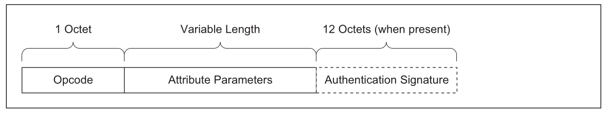
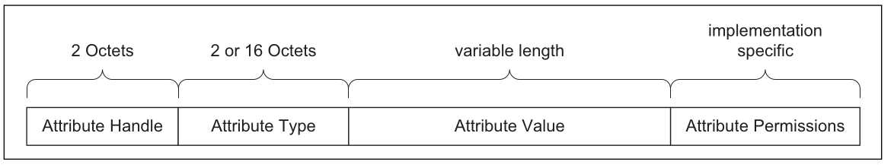
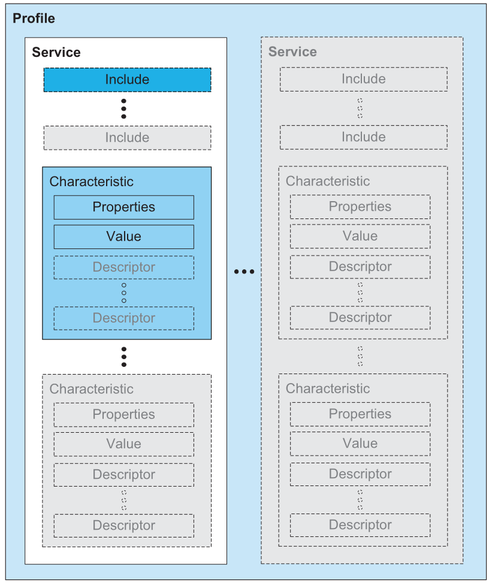
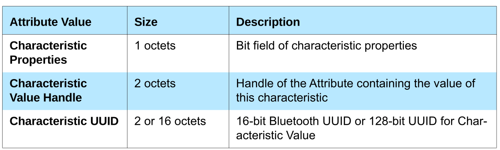
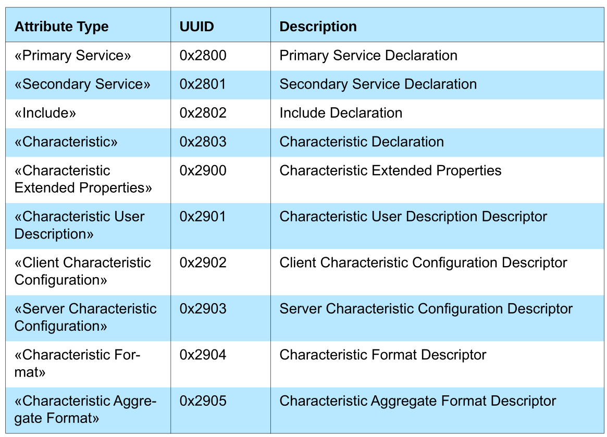

# GENERIC ATTRIBUTE PROFILE

------

## INTRODUCTION

The **Generic Attribute Profile (GATT)** defines a service framework using the Attribute Protocol. This framework defines procedures and formats of services and their characteristics. The procedures defined include discovering, reading, writing, notifying and indicating characteristics, as well as configuring the broadcast of characteristics.

This profile can be used over any physical link, using the Attribute Protocol L2CAP channel, known as the **ATT Bearer**.

**Client**—This is the device that initiates commands and requests towards the server and can receive responses, indications and notifications sent by the server.

**Server**—This is the device that accepts incoming commands and requests from the client and sends responses, indications and notifications to a client.

The following scenarios are covered by GATT profile:

- Exchanging configuration

- Discovery of services and characteristics on a device
- Reading a characteristic value
- Writing a characteristic value
- Notification of a characteristic value
- Indication of a characteristic value

------

## ATT PROTOCOL OVERVIEW

The GATT Profile uses the Attribute Protocol to transport data in the form of commands, requests, responses, indications, notifications and confirmations between devices. This data is contained in Attribute Protocol PDUs.

- The **Opcode** contains the specific command, request, response, indication, notification or confirmation opcode and a flag for authentication. 
- The **Attribute Parameters** contain data for the specific command or request or the data
  returned in a response, indication or notification. 
- The **Authentication Signature** is optional.

Attribute Protocol commands and requests act on values stored in Attributes on the server device. An Attribute is composed of four parts: Attribute Handle, Attribute Type, Attribute Value, and Attribute Permissions.

- The **Attribute Handle** is an index corresponding to a specific Attribute. 
- The **Attribute Type** is a UUID that describes the Attribute Value. 
- The **Attribute Value** is the data described by the Attribute Type and indexed by the Attribute Handle.
- The **Attribute Permissions** is part of the Attribute that cannot be read from or written to using the Attribute Protocol. It is used by the server to determine whether read or write access is permitted for a given attribute.

**Attribute caching** is an optimization that allows the client to discover the Attribute information such as Attribute Handles used by the server once and use the same Attribute information across reconnections without rediscovery. The Attribute information that shall be cached by a client is the Attribute Handles of all server attributes and the GATT service characteristics values. Attribute Handles used by the server should not change over time. This means that once an Attribute Handle is discovered by a client the Attribute Handle for that Attribute should not be changed.

If GATT based services on the server cannot be changed during the usable lifetime of the device, the **Service Changed characteristic** shall not exist on the server and the client does not need to ever perform service discovery after the initial service discovery for that server.

Generic attribute profile defines **grouping** of attributes for three attribute types:

- «Primary Service»
- «Secondary Service» 
- «Characteristic»

------

## GATT PROFILE HIERARCHY

The top level of the hierarchy is a **profile**. A profile is composed of one or more **services** necessary to fulfill a use case. A service is composed of **characteristics** or references to other services. Each characteristic contains a **value** and may contain optional information about the value.

#### Service

A service is a collection of data and associated behaviors to accomplish a particular function or feature. In GATT, a service is defined by its service definition. A service definition may contain referenced services, mandatory characteristics and optional characteristics. There are two types of services: primary service and secondary service.

A **primary service** is a service that exposes the primary usable functionality of this device. A primary service can be included by another service. Primary services can be discovered using Primary Service Discovery procedures.

A **secondary service** is a service that is only intended to be referenced from a primary service or another secondary service or other higher layer specification. A secondary service is only relevant in the context of the entity that references it.

#### Included Services

An included service is a method to **reference** another service definition existing on the server into the service being defined. To include another service, an include definition is used at the beginning of the service definition. When a service definition uses an include definition to reference the included service, the entire included service definition becomes part of the new service definition. This includes all the included services and characteristics of the included service.

#### Characteristic

A **characteristic** is a value used in a service along with properties and configuration information about how the value is accessed and information
about how the value is displayed or represented. In GATT, a characteristic is defined by its characteristic definition. A characteristic definition contains a characteristic declaration, characteristic properties, and a value and may contain descriptors that describe the value or permit configuration of the server with respect to the characteristic.

------

## SERVICE INTEROPERABILITY REQUIREMENTS

### SERVICE DEFINITION

A **service definition** shall contain a service declaration and may contain include definitions and characteristic definitions. All include definitions and characteristic definitions contained within the service definition are considered to be part of the service. All include definitions shall immediately follow the service declaration and precede any characteristic definitions. All characteristic definitions shall be immediately following the last include definition or in the event of no include definitions, immediately following the service declaration.

A **service declaration** is an Attribute with the Attribute Type set to the UUID for «Primary Service» (0x2800 UUID) or «Secondary Service»  (0x2801 UUID). The Attribute Value shall be the 16-bit Bluetooth UUID or 128-bit UUID for the service, known as the **service UUID**. The Attribute Permissions shall be read-only and shall not require authentication or authorization.

### INCLUDE DEFINITION

An **include definition** shall contain only one include declaration.

The **include declaration** is an Attribute with the Attribute Type set to the UUID for «Include» (0x2802 UUID). The Attribute Value shall be set to the included service Attribute Handle, the End Group Handle, and the service UUID. The Service UUID shall only be present when the UUID is a 16-bit Bluetooth UUID. The Attribute Permissions shall be read only and not require authentication or authorization.

### CHARACTERISTIC DEFINITION

A **characteristic definition** shall contain a characteristic declaration, a Characteristic Value declaration and may contain characteristic descriptor declarations.

Each declaration above is contained in a separate Attribute. The two required declarations are the **characteristic declaration** and the **Characteristic Value declaration**. The Characteristic Value declaration shall exist immediately following the characteristic declaration. Any optional characteristic descriptor declarations are placed after the Characteristic Value declaration.

#### Characteristic Declaration

A **characteristic declaration** is an Attribute with the Attribute Type set to the UUID for «Characteristic» (0x2803) and Attribute Value set to the Characteristic Properties, Characteristic Value Attribute Handle and Characteristic UUID. The Attribute Permissions shall be readable and not require authentication or authorization.

- **Characteristic Properties** - bit field determines how the Characteristic Value can be used, or how the characteristic descriptors can be accessed. Use example is broadcast, read, write , notify, indicate and so on. Look at Vol 3, Part G, 3.3.1.1, Table 3.5
- **Characteristic Value Attribute Handle** - field is the Attribute Handle of the Attribute that contains the Characteristic Value
- **Characteristic UUID** - field is a 16-bit Bluetooth UUID or 128-bit UUID that describes the type of Characteristic Value

#### Characteristic Value Declaration

The **Characteristic Value declaration** contains the value of the characteristic. It is the first Attribute after the characteristic declaration. All characteristic definitions shall have a Characteristic Value declaration.

A Characteristic Value declaration is an Attribute with the **Attribute Typ**e set to the 16-bit Bluetooth or 128-bit UUID for the Characteristic Value used in the characteristic declaration. The **Attribute Value** is set to the Characteristic Value. The **Attribute Permissions** are specified by the service or may be implementation specific if not specified otherwise.

#### Characteristic Descriptor Declarations

**Characteristic descriptors** are used to contain related information about the Characteristic Value. Each characteristic descriptor is identified by the characteristic descriptor UUID. Characteristic descriptors if present within a characteristic definition shall follow the Characteristic Value declaration.

The GATT profile defines a standard set of characteristic descriptors that can be used by higher layer profiles. Higher layer profiles may define additional characteristic descriptors that are profile specific. 

- **Characteristic Extended Properties** - descriptor that defines additional Characteristic Properties. The Characteristic Extended Properties bit field describes additional properties on how the Characteristic Value can be used, or how the characteristic descriptors can be accessed. Look at Vol 3, Part G, 3.3.1.1, Table 3.8
- **Characteristic User Description** - defines a UTF-8 string of variable size that is a user textual description of the Characteristic Value.
- **Client Characteristic Configuration** - defines how the characteristic may be configured by a specific client. The characteristic descriptor value is a bit field. When a bit is set, that action (notify, indicate) shall be enabled, otherwise it will not be used. A client may write this configuration descriptor to control the configuration of this characteristic on the server for the client. Each client has **its own instantiation** of the Client Characteristic Configuration. Reads of the Client Characteristic Configuration only shows the configuration for that client and writes only affect the configuration of that client.
- **Server Characteristic Configuration** - defines how the characteristic may be configured for the server. The characteristic descriptor value is a bit field. When a bit is set, that action (broadcast) shall be enabled, otherwise it will not be used. A client may write this configuration descriptor to control the configuration of this characteristic on the server for all clients. There is a single instantiation of the Server Characteristic Configuration for all clients. Reads of the Server Characteristic Configuration shows the configuration all clients and writes affect the configuration for all clients.
- **Characteristic Presentation Format** - defines the format of the Characteristic Value. If more than one Characteristic Presentation Format declarations exist, in a characteristic definition, then a Characteristic Aggregate Format declaration shall exist as part of the characteristic definition. The characteristic format value is composed of five parts: 
  - format  - uint8, int32, float and so on
  - exponent - multiply characteristic value by 10 powered exponent
  - unit - UUID of physical units (meters, seconds, volts and so on)
  - name space - used to identify the organization (Bluetooth SIG is only no)
  - description - enumerated value as defined in the Assigned Numbers document (left, right, bottom, top, inside, outside and so on)
- **Characteristic Aggregate Format** - defines the format of an aggregated Characteristic Value. The Characteristic Aggregate Format value is composed of a list of Attribute Handles of Characteristic Presentation Format declarations, where each Attribute Handle points to a Characteristic Presentation Format declaration.

### SUMMARY OF GATT PROFILE ATTRIBUTE TYPES

------

## GATT FEATURE REQUIREMENTS
