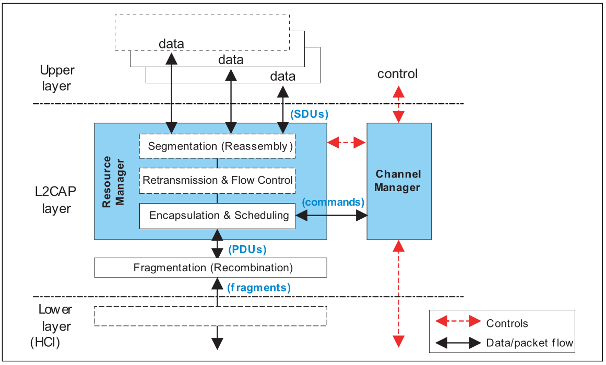
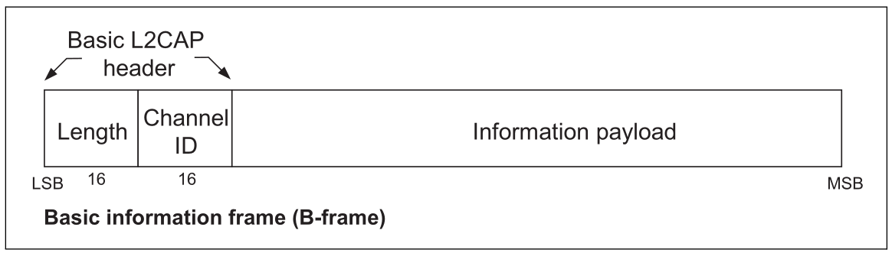
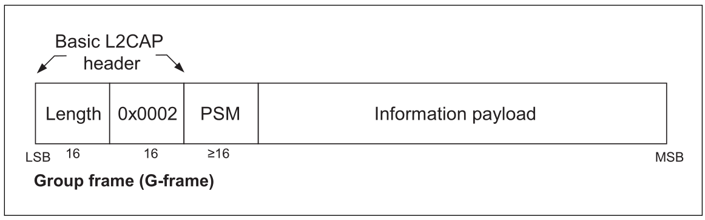
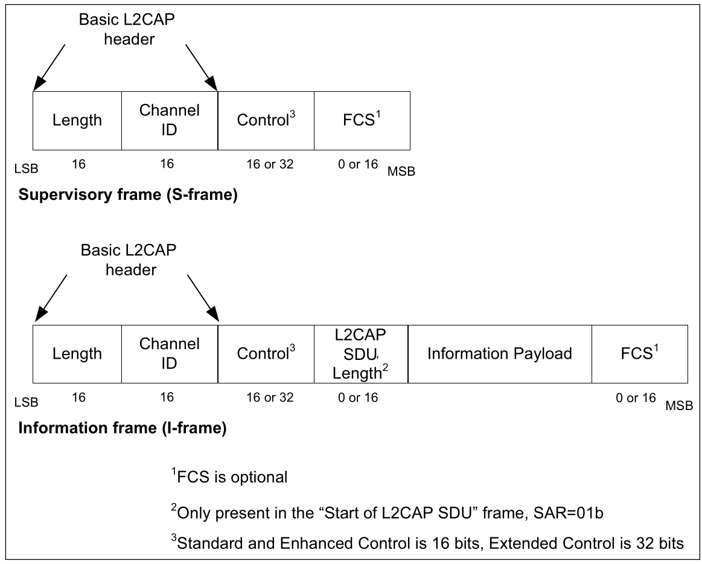
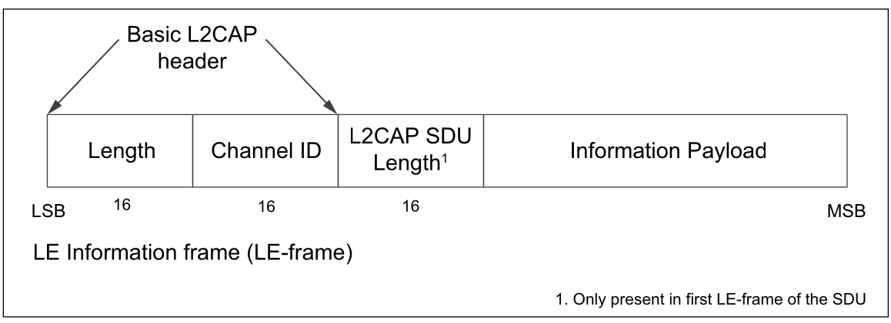
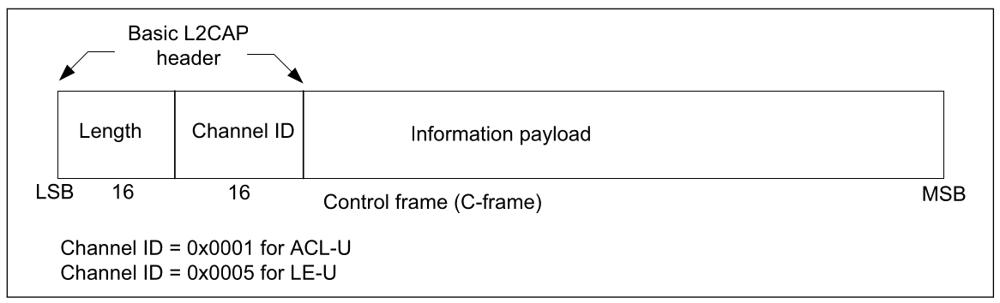
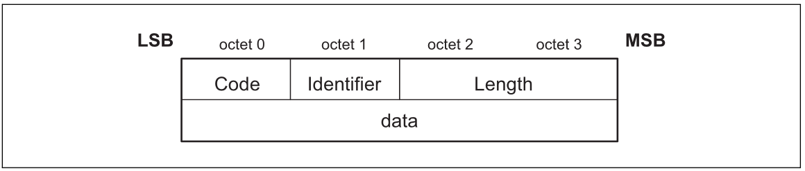
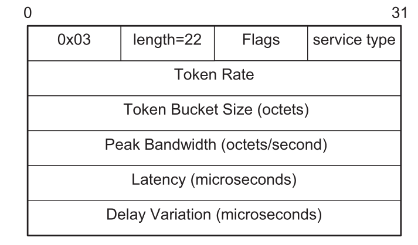
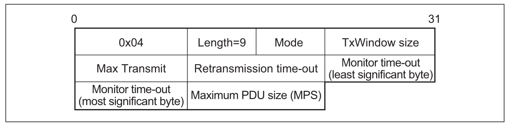
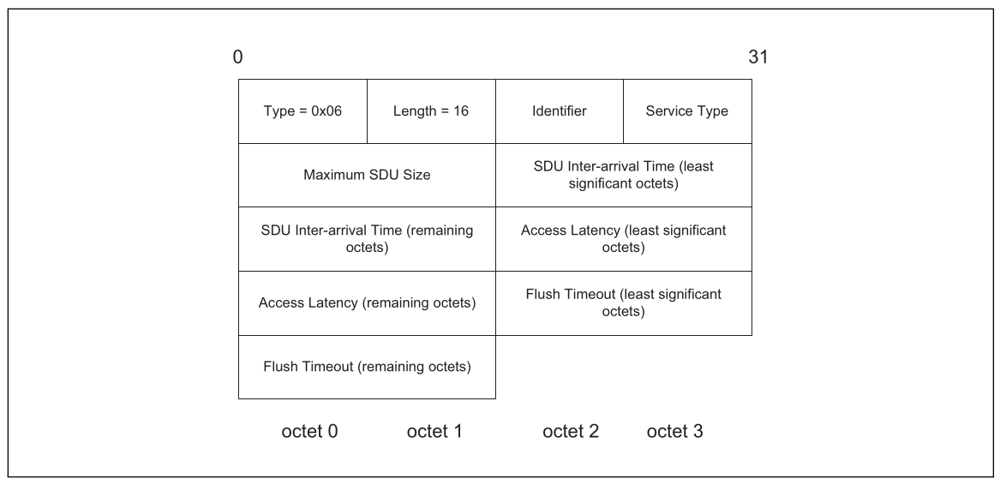

# LOGICAL LINK CONTROL AND ADAPTATION PROTOCOL

------

## INTRODUCTION

- **Protocol/channel multiplexing** - L2CAP supports multiplexing over individual Controllers and across multiple Controllers. An L2CAP channel shall operate over one Controller at a time.
- **Segmentation and reassembly** - With the frame relay service offered by the Resource Manager, the length of transport frames is controlled by the individual applications running over L2CAP. Many multiplexed applications are better served if L2CAP has control over the PDU length
- **Flow control per L2CAP channel** - Controllers provide error and flow control for data going over the air and HCI flow control exists for data going over an HCI transport
- **Fragmentation and Recombination** - Some Controllers may have limited transmission capabilities and may require fragment sizes different from those created by L2CAP segmentation. Therefore layers below L2CAP may further fragment and recombine L2CAP PDUs to create fragments which fit each layer’s capabilities

------

## TERMINOLOGY

- **L2CAP channel** - the logical connection between two endpoints in peer devices, characterized by their Channel Identifiers (CID)
- **Service Data Unit (SDU)** - a packet of data that L2CAP exchanges with the upper layer and transports transparently over an L2CAP channel
- **Segment** - part of an SDU, as resulting from the Segmentation procedure
- **Protocol Data Unit (PDU)** - protocol Data Unit: a packet of data containing L2CAP protocol information fields, control information, and/or upper layer information data
- **Basic L2CAP header** - minimum L2CAP protocol information that is present in the beginning of each PDU
- **Fragment** - a part of a PDU, as resulting from a fragmentation operation. Fragments are used only in the delivery of data to and from the lower layer
- **Maximum Transmission Unit (MTU)** - the maximum size of payload data, in octets, that the upper layer entity is capable of accepting, i.e. the MTU corresponds to the **maximum SDU size**
- **Maximum PDU payload Size (MPS)** - the maximum size of payload data in octets that the L2CAP layer entity is capable of accepting, i.e. the MPS corresponds to the **maximum PDU payload size**
- **Signaling MTU (MTUsig)** - the maximum size of command information that the L2CAP layer entity is capable of accepting. The MTUsig, refers to the signaling channel only and corresponds to the **maximum size of a C-frame**
- **Connectionless MTU (MTUcnl)** - the maximum size of the connection packet information that the L2CAP layer entity is capable of accepting. The MTUcnl refers to the connectionless channel only an  corresponds to the **maximum G-frame**
- **MaxTransmit** - in Enhanced Retransmission mode and Retransmission mode, MaxTransmit controls the number of transmissions of a PDU that L2CAP is allowed to try before assuming that the PDU is lost

------

## GENERAL OPERATION

#### CHANNEL IDENTIFIERS

A channel identifier (CID) is the local name representing a logical channel endpoint on the device. 

The null identifier (0x0000) shall never be used as a destination endpoint. Identifiers from 0x0001 to 0x003F are reserved for specific L2CAP functions. 

Implementations are free to manage the remaining CIDs in a manner best suited for that particular implementation, with the provision that two simultaneously active L2CAP channels shall not share the same CID.

#### MODES OF OPERATION

L2CAP channels may operate in one of five different **modes** as selected for each L2CAP channel.

- **Basic L2CAP Mode** - the default mode, which is used when no other mode is agreed
- **Flow Control mode** - PDUs exchanged with a peer entity are numbered and acknowledged. No retransmissions take place, but missing PDUs are detected and can be reported as lost
- Retransmission mode - PDUs exchanged with a peer entity are numbered and acknowledged. A timer is used to ensure that all PDUs are delivered to the peer, by retransmitting PDUs as needed
- **Enhanced Retransmission mode** - PDUs exchanged with a peer entity are numbered and acknowledged. Similar to Retransmission mode. It adds the ability to set a POLL bit to solicit a response from a remote L2CAP entity, the SREJ S-frame to improve the efficiency of error recovery and adds an RNR S-frame to replace the R-bit for reporting a local busy condition
- **Streaming mode** - real-time isochronous traffic. PDUs are numbered but are not acknowledged. A finite flush timeout is set on the sending side to flush packets that are not sent in a timely manner. On the receiving side if the receive buffers are full when a new PDU is received then a previously received PDU is overwritten by the newly received PDU. Missing PDUs can be detected and reported as lost
- **LE Credit Based Flow Control Mode** - for LE L2CAP connection oriented channels for flow control using a credit based scheme for L2CAP data. This is the only mode that shall be used for LE L2CAP connection oriented channels

------

## DATA PACKET FORMAT

L2CAP is packet-based but follows a communication model based on **channels**. A channel represents a data flow between L2CAP entities in remote
devices. 

Channels may be **connection-oriented** or **connectionless**. Fixed channels other than the L2CAP connectionless channel (CID 0x0002) and the two L2CAP signaling channels (CIDs 0x0001 and 0x0005) are considered connection-oriented.  All channels with dynamically assigned CIDs are connection-oriented.

#### B-frame

In basic L2CAP mode, the L2CAP PDU on a connection-oriented channel is also referred to as a "**B-frame**"

#### G-frame

L2CAP PDU format within a connectionless data channel is referred to as a "**G-frame**". 

**Protocol/Service Multiplexer (PSM)** - identifier of higher-level Bluetooth protocol (like RFCOMM or GATT) or application, allowing multiple services to share a single L2CAP channel, similar to port numbers in TCP/IP.

#### I/S-frame

To support **flow control**, **retransmissions**, and **streaming**, L2CAP PDU types with protocol elements in addition to the Basic L2CAP header are defined. 

The information frames (**I-frames**) are used for information transfer between L2CAP entities. 

The supervisory frames (**S-frames**) are used to acknowledge I-frames and request retransmission of I-frames.

The **Control Field** identifies the type of frame. 

There are three different Control Field formats: 

- **Standard Control Field** - shall be used for Retransmission mode and Flow Control mode
- **Enhanced Control Field** - shall be used for Enhanced Retransmission mode and Streaming mode
- **Extended Control Field** - may be used for Enhanced Retransmission mode and Streaming mode

The Control Field will contains:

- Send Sequence Number (TxSeq)
- Receive Sequence Number (ReqSeq)
- Retransmission Disable Bit (R)
- Segmentation and Reassembly (SAR) - start, end, middle of SDU
- Supervisory function (S) - only in S-frame: RR (Receiver Ready), REJ (Reject), RNR (Receiver Not Ready) and SREJ (Selective Reject)
-  Poll (P)
- Final (F)

The L2CAP SDU **Length Field** shall specify the total number of octets in the SDU, when an SDU spans more than one I-frame. The first I-frame in the sequence shall be identified by SAR=”Start of L2CAP SDU”. 

The **Frame Check Sequence** (FCS) is constructed using the generator polynomial g(D) = D^16 + D^15 + D^2 + 1. The 16 bit LFSR is initially loaded with the value 0x0000. The FCS covers the Basic L2CAP header, Control, L2CAP-SDU length and Information payload fields

#### LE-frame

In LE Credit Based Flow Control Mode, the L2CAP PDU on a connection-oriented channel is an LE information frame (**LE-frame**)

The first LE-frame of the SDU shall contain the L2CAP SDU **Length field** that shall specify the total number of octets in the SDU. All subsequent LE-frames that are part of the same SDU shall not contain the L2CAP SDU Length field.

------

## SIGNALING PACKET FORMATS

All signaling commands are sent over a signaling channel. 

The signaling channel for managing channels over ACL-U logical links shall use **CID 0x0001** and the signaling channel for managing channels over LE-U logical links shall use **CID 0x0005**.

 Multiple commands may be sent in a single C-frame over Fixed Channel CID 0x0001 while only one command per C-frame shall be sent over Fixed Channel CID 0x0005

General format of L2CAP PDUs containing signaling commands (**C-frames**):

General format of all signaling commands (**C-frame payload**):

- **Code** - identifies the type of command
- **Identifier** - tag that matches responses with requests. The requesting device sets this field and the responding device uses the same value in its response. Within each signaling channel a different Identifier shall be used for each successive command.
- **Length** - indicates the size in octets of the data field of the command only, i.e., it does not cover the Code, Identifier, and Length fields
- **Data** - field is variable in length. The Code field determines the format of the Data field. The length field determines the length of the data field

#### SIGNALING COMMANDS

- **COMMAND REJECT (CODE 0x01)** - shall be sent in response to a command packet with an unknown command code or when sending the corresponding response is inappropriate.
- **CONNECTION REQUEST (CODE 0x02)** - sent to create an L2CAP channel between two devices. The L2CAP channel shall be established before configuration begins.
- **CONNECTION RESPONSE (CODE 0x03)** - when a device receives a Connection Request packet, it shall send a Connection Response packet.
- **CONFIGURATION REQUEST (CODE 0x04)** - sent to establish an initial logical link transmission contract between two L2CAP entities and also to re-negotiate this contract whenever appropriate. The contract consists of a set of configuration parameter options. The only parameters that should be included in the Configuration Request packet are those that require different values than the default or previously agreed values.
- **CONFIGURATION RESPONSE (CODE 0x05)** - sent in reply to Configuration Request packets except when the error condition is covered by a Command Reject response. Each configuration parameter value (if any is present) in a Configuration Response reflects an ’adjustment’ to a configuration parameter value that has been sent (or, in case of default values, implied) in the corresponding Configuration Request.
- **DISCONNECTION REQUEST (CODE 0x06)** - terminating an L2CAP channel requires that a disconnection request be sent and acknowledged by a disconnection response.
- **DISCONNECTION RESPONSE (CODE 0x07)** - disconnection responses shall be sent in response to each valid disconnection request.
- **ECHO REQUEST (CODE 0x08)** - used to request a response from a remote L2CAP entity. These requests may be used for testing the link or for passing vendor specific information using the optional data field
- **ECHO RESPONSE (CODE 0x09)** - sent upon receiving a valid Echo Request. 
- **INFORMATION REQUEST (CODE 0x0A)** -  used to request implementation specific information from a remote L2CAP entity. An L2CAP implementation shall only use optional features or attribute ranges for which the remote L2CAP entity has indicated support through an Information Response. Until an Information Response which indicates support for optional features or ranges has been received only mandatory features and ranges shall be used.
- **INFORMATION RESPONSE (CODE 0x0B)** - an information response shall be sent upon receiving a valid Information Request.
- **CONNECTION PARAMETER UPDATE REQUEST (CODE 0x12)** - shall only be sent from the LE slave device to the LE master device and only if one or more of the LE slave Controller, the LE master Controller, the LE slave Host and the LE master Host do not support the **Connection Parameters Request Link Layer Control Procedure**. The Connection Parameter Update Request allows the LE slave Host to request a set of new connection parameters. When the LE master Host receives a Connection Parameter Update Request packet, depending on the parameters of other connections, the LE master Host may accept the requested parameters and deliver the requested parameters to its Controller or reject the request.
- **CONNECTION PARAMETER UPDATE RESPONSE (CODE 0x13)** - shall only be sent from the LE master device to the LE slave device. The Connection Parameter Update Response packet shall be sent by the master Host when it receives a Connection Parameter Update Request packet. If the LE master Host accepts the request it shall send the connection parameter update to its Controller.
- **LE CREDIT BASED CONNECTION REQUEST (CODE 0x14)** - sent to create and configure an L2CAP channel between two devices. The initial credit value indicates the number of LE-frames that the peer device can send to the L2CAP layer entity sending the LE Credit Based Connection Request
- **LE CREDIT BASED CONNECTION RESPONSE (CODE 0x15)** - when a device receives a LE Credit Based Connection Request packet, it shall send a LE Credit Based Connection Response packet.
- **LE FLOW CONTROL CREDIT (CODE 0x16)** - a device shall send a LE Flow Control Credit packet when it is capable of receiving additional LE-frames. The credit value field represents number of credits the receiving device can increment, corresponding to the number of LE-frames that can be sent to the peer device sending the LE Flow Control Credit packet.

------

## CONFIGURATION PARAMETER OPTIONS

#### MAXIMUM TRANSMISSION UNIT (MTU)

This option specifies the **maximum SDU size** the sender of this option is capable of accepting for a channel. MTU is not a negotiated value, it is an informational parameter that each device can specify independently. It indicates to the remote device that the local device can receive, in this channel, an MTU larger than the minimum required. L2CAP implementations shall support a minimum MTU size of 48 octets.

#### FLUSH TIMEOUT OPTION

This option is used to inform the recipient of the Flush Timeout the sender is going to use.

- 0x0001 - no retransmissions at the baseband level should be performed since the minimum polling interval is 1.25 ms.
- 0x0002 to 0xFFFE - Flush Timeout used by the baseband.
- 0xFFFF - an infinite amount of retransmissions. This is also referred to as a ’reliable channel’. In this case, the baseband shall continue retransmissions until physical link loss is declared by link manager timeouts.

#### QUALITY OF SERVICE (QOS) OPTION

This option specifies a flow specification similar to **RFC 1363**. The Bluetooth QoS interface can handle the two directions (Tx and Rx) in the negotiation.

L2CAP implementations are only required to support **’Best Effort’** service, support for any other service type is optional. Best Effort does not require any guarantees. If no QoS option is placed in the request, Best Effort shall be assumed. If any QoS guarantees are required then a QoS configuration request shall be sent.

- **Flags** - reserved
- **Service Type** - indicates the level of service required (No traffic, Best effort, Guaranteed)
- **Token Rate** - represents the average data rate with which the application transmits data.  The Token Rate is the rate with which traffic credits are provided. Credits can be accumulated up to the Token Bucket Size. Traffic credits are consumed when data is transmitted by the application. When traffic is transmitted, and there are insufficient credits available, the traffic is non- conformant. The Quality of Service guarantees are only provided for conformant traffic. The Token Rate is specified in octets per second.
- **Token Bucket Size** - The Token Bucket Size specifies a limit on the 'burstiness' with which the application may transmit data. The application may offer a burst of data equal to the Token Bucket Size instantaneously, limited by the Peak Bandwidth (see below). The Token Bucket Size is specified in octets.
- **Peak Bandwidth** - The value of this field, expressed in octets per second, limits how fast packets from applications may be sent back-to-back. Some systems can take advantage of this information, resulting in more efficient resource allocation.
- **Access Latency** - The value of this field is the maximum acceptable delay of an L2CAP packet to the air-interface. The precise interpretation of this number depends on over which interface this flow parameter is signaled. When signaled between two L2CAP peers, the Access Latency is the maximum acceptable delay between the instant when the L2CAP SDU is received from the upper layer and the start of the L2CAP SDU transmission over the air. The Access Latency is expressed in microseconds.
- **Delay Variation** - The value of this field is the difference, in microseconds, between the maximum and minimum possible delay of an L2CAP SDU between two L2CAP peers. The Delay Variation is a purely informational parameter.

**RETRANSMISSION AND FLOW CONTROL OPTION**

This option specifies whether retransmission and flow control is used. If the feature is used both incoming and outgoing parameters are specified by this option.

- **Mode** - contains the requested mode of the link (L2CAP Basic Mode, Retransmission mode, Flow control mode, Enhanced Retransmission mode, Streaming mode). The Basic L2CAP mode is the default.
- **TxWindow size** - specifies the size of the transmission window for Flow Control mode, Retransmission mode, and Enhanced Retransmission mode. In Retransmission mode and Flow Control mode this parameter Tx Window size should be made as large as possible to maximize channel utilization. Tx Window size also controls the delay on flow control action. The transmitting device can send as many PDUs fit within the window. In Enhanced Retransmission mode this value indicates the maximum number of I-frames that the sender of the option can receive without acknowledging some of the received frames.
- **MaxTransmit** - controls the number of retransmissions that L2CAP is allowed to try in Retransmission mode and Enhanced Retransmission mode before accepting that a packet and the channel is lost. When a packet is lost after being transmitted MaxTransmit times the channel shall be disconnected by sending a Disconnect request. In Enhanced Retransmission mode a value of zero for MaxTransmit means infinite retransmissions.
- **Retransmission time-out** - the value in milliseconds of the retransmission time-out (this value is used to initialize the RetransmissionTimer).
- **Monitor time-out** - value in milliseconds of the interval at which S-frames should be transmitted on the return channel when no frames are received on the forward channel. (this value is used to initialize the MonitorTimer, see below). This timer ensures that lost acknowledgments are retransmitted.
- **Maximum PDU payload Size (MPS)** - The maximum size of payload data in octets that the L2CAP layer entity sending the option in a Configuration Request is capable of accepting, i.e. the MPS corresponds to the maximum PDU payload size.

#### FRAME CHECK SEQUENCE (FCS) OPTION

This option is used to specify the type of Frame Check Sequence (FCS) that will be included on S/I-frames that are sent. The FCS option shall only be used when the mode is being, or is already configured to Enhanced Retransmission mode or Streaming mode. Value of 0x00 is set when the sender wishes to omit the FCS from S/I-frames.

#### EXTENDED FLOW SPECIFICATION OPTION

This option specifies a flow specification for requesting a desired Quality of Service (QoS) on a channel. The Extended Flow Specification shall be supported on all channels created over AMP-U logical links. Optionally, Extended Flow Specification may be supported on channels created over ACL-U logical links.

#### EXTENDED WINDOW SIZE OPTION

The sender of a Configuration Request command containing this option is suggesting the maximum window size (possibly based on its own internal L2CAP receive buffer resources) that the peer L2CAP entity should use when sending data.

------

## STATE MACHINE
