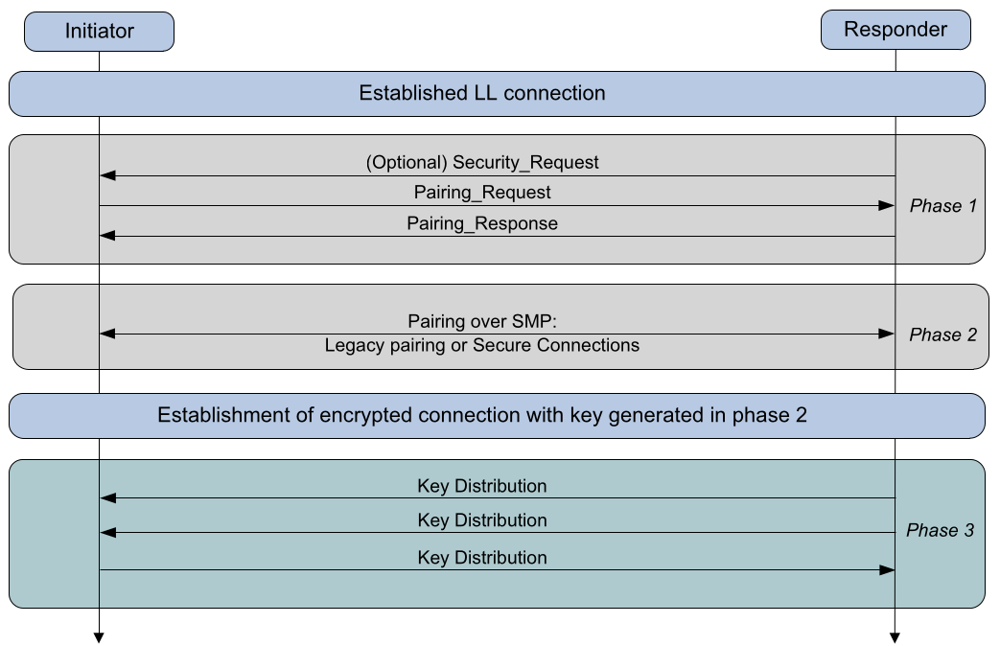
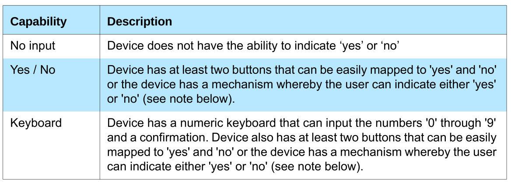
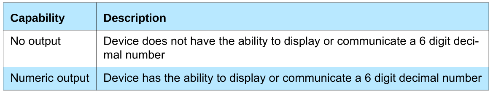
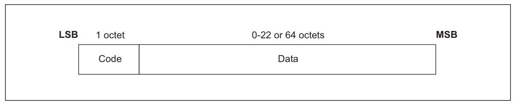

# SECURITY MANAGER

------

## INTRODUCTION

The **Security Manager** (SM) uses a key distribution approach to perform identity and encryption functionalities in radio communication. This means that each device generates and controls the keys it distributes and no other device affects the generation of these keys.

**Pairing** is performed to establish keys which can then be used to encrypt a link. A transport specific key distribution is then performed to share the keys which can be used to encrypt a link in future reconnections, verify signed data and random address resolution.

Pairing is a three-phase process:

- Phase 1: Pairing Feature Exchange
- Phase 2: Short Term Key (STK) Generation (LE legacy pairing), Long Term Key (LTK) Generation (LE Secure Connections)
- Phase 3: Transport Specific Key Distribution

The devices shall first exchange **authentication requirements** and **IO capabilities** in the Pairing Feature Exchange to determine which of the following methods shall be used in Phase 2:

- Just Works
- Numeric Comparison (Only for LE Secure Connections)
- Passkey Entry
- Out Of Band (OOB) 

Optionally, Phase 3 may then be performed to distribute transport specific keys, for example the Identity Resolving Key (IRK) value and Identity Address information.

------

## CRYPTOGRAPHIC TOOLBOX

In order to support random addressing, pairing and other operations SM provides a toolbox of cryptographic functions. The following cryptographic functions are defined:

- **ah** is used to create a 24-bit hash used in random address creation and resolution. 

The following cryptographic functions are defined to support the LE legacy pairing process:

- **c1** is used to generate confirm values used during the pairing process.
- **s1** is used to generate the STK during the pairing process.

The following cryptographic functions are defined to support the LE Secure Connections pairing process:

- **f4** is used to generate confirm values during the pairing process.
- **f5** is used to generate the LTK and the MacKey during the pairing process.
- **f6** is used to generate the check values during authentication stage 2 in the pairing process.
- **g2** is used to generate the 6-digit numeric comparison values during authentication stage 1 in the pairing process.
- **h6** is used to generate the LE LTK from a BR/EDR link key derived from Secure Connections and is used to generate the BR/EDR link key from an LE LTK derived from Secure Connections.
- **h7** is used to generate intermediate keys while generating the LE LTK from a BR/EDR link key derived from Secure Connections and the BR/EDR link key from an LE LTK derived from Secure Connections.

The building block for the cryptographic functions ah, c1 and s1 is the security function **e**.

The building block for the cryptographic functions f4, f5, f6, g2, h6, and h7 is the security function **AES-CMAC**.

For more information look at **Vol 3, Part H, 2.2**

------

## PAIRING METHODS

When pairing is started, the Pairing Feature Exchange shall be initiated by the initiating device.

The Pairing Feature Exchange is used to exchange IO capabilities, OOB authentication data availability, authentication requirements, key size requirements and which transport specific keys to distribute. They are used to determine the key generation method used in **Phase 2**.

Authentication requirements are set by GAP. The authentication requirements include the type of bonding and man-in-the- middle protection (MITM) requirements.

Security properties provided by SM are classified into the following categories:

- LE Secure Connections pairing
- Authenticated MITM protection
- Unauthenticated no MITM protection
- No security requirements

Security properties of the key generated in phase 2 under which the keys are distributed shall be stored in the security database.

#### IO Capabilities

#### OOB Authentication Data

An out of band mechanism may be used to communicate information which is used during the pairing process. The OOB data flag shall be set if a device has the peer device's out of band authentication data.

In **LE legacy pairing**, the out of band method is used if both the devices have the other device's out of band authentication data available.

In **LE Secure Connections pairing**, the out of band method is used if at least one device has the peer device's out of band authentication data available.

#### Encryption Key Size

Each device shall have maximum and minimum encryption key length parameters which defines the maximum and minimum size of the encryption key allowed in octets.

The smaller value of the initiating and responding devices maximum encryption key length parameters shall be used as the encryption key size.

Both the initiating and responding devices shall check that the resultant encryption key size is not smaller than the minimum key size parameter for that device.

#### Pairing Algorithms

The information exchanged in Phase 1 is used to select which key generation method is used in Phase 2.

When LE legacy pairing is used, the pairing is performed by each device generating a **Temporary Key** (TK). Generation methods are: **Just Works**, **Passkey Entry**, **Out Of Band**.

The TK value shall be used in the authentication mechanism generate the **STK** and encrypt the link.

If both devices **have not** set the **MITM** option in the Authentication Requirements Flags, then the IO capabilities shall be ignored and the **Just Works** association model shall be used.

In **LE legacy pairing**, if both devices have Out of Band authentication data, then the Authentication Requirements Flags shall be ignored when selecting the pairing method and the Out of Band pairing method shall be used. Otherwise, the IO capabilities of the device shall be used to determine the pairing method (Vol 3, Part H, 2.3.5.1, Table 2.8)

In LE Secure Connections pairing, if one or both devices have out of band authentication data, then the Authentication Requirements Flags shall be ignored when selecting the pairing method and the Out of Band pairing method shall be used. Otherwise, the IO capabilities of the device shall be used to determine the pairing method (Vol 3, Part H, 2.3.5.1, Table 2.8)

- **Just Works** - STK generation method provides no protection against eavesdroppers or man in the middle attacks during the pairing process. If the attacker is not present during the pairing process then confidentiality can be established by using encryption on a future connection.
- **Passkey Entry** - STK generation method uses 6 numeric digits passed out of band by the user between the devices. Device shall display a randomly generated passkey value between 000,000 and 999,999. The display shall ensure that all 6 digits are displayed – including zeros. The other device shall allow the user to input a value between 000,000 and 999,999.
- **Out of Band** - An out of band mechanism may be used to communicate information to help with device discovery, for example device address, and the 128-bit TK value used in the pairing process. Out of Band method can be more secure than using the Passkey Entry or Just Works methods. However, both devices need to have matching OOB interfaces.

------

## Pairing Phase 2

### LE Legacy

1. The initiating device generates a 128-bit random number (**Mrand**).
2. The initiating device calculates the 128-bit confirm value (**Mconfirm**) using the confirm value generation function **c1**. Parameter **k** set to **TK**.
3. The responding device generates a 128-bit random number (**Srand**).
4. The responding device calculates the 128-bit confirm value (**Sconfirm**) using the confirm value generation function **c1**. Parameter **k** set to **TK**.
5. The initiating device transmits **Mconfirm** to the responding device.
6. When the responding device receives **Mconfirm** it transmits **Sconfirm** to the initiating device.
7. When the initiating device receives **Sconfirm** it transmits **Mrand** to the responding device.
8. The responding device verifies the **Mconfirm** value by repeating the calculation the initiating device performed, using the **Mrand** value received.
9. If the responding device’s calculated **Mconfirm** value matches the received **Mconfirm** value from the initiating device the responding device transmits **Srand** to the initiating device.
10. The initiating device verifies the received **Sconfirm** value by repeating the calculation the responding device performed, using the **Srand** value received.
11. If the initiating device’s calculated **Sconfirm** value matches the received **Sconfirm** value from the responding device the initiating device then calculates **STK** and tells the Controller to enable encryption. **STK** is generated using the key generation function **s1**

### LE Secure Connections

1. Public Key Exchange - Initially, each device generates its own Elliptic Curve Diffie-Hellman (**ECDH**)
2. Authentication Stage 1
   - Just Works or Numeric Comparison - 
     1. After the public keys have been exchanged, each device selects a pseudo-random 128-bit nonce
     2. Following this the responding device then computes a commitment to the two public keys that have been exchanged and its own nonce value
     3. This commitment is computed as a one-way function of these values and is transmitted to the initiating device
     4. The initiating and responding devices then exchange their respective nonce values
     5. Initiating device confirms the commitment
     6. When Numeric Comparison is used, assuming that the commitment check succeeds, the two devices each compute 6-digit confirmation values that are displayed to the user on their respective devices
   - Passkey Entry
     1. The user inputs an identical Passkey into both devices. Alternately, the Passkey may be generated and displayed on one device, and the user then inputs it into the other
     2. Each side commits to each bit of the Passkey, using a long nonce (128 bits), and sending the hash of the nonce, the bit of the Passkey, and both public keys to the other party.
   - Out of Band
     1. If both devices can transmit and/or receive data over an out-of-band channel, then mutual authentication will be based on the commitments of the public keys (Ca and Cb) exchanged OOB in Authentication stage 1
     2. If OOB communication is possible only in one direction, then authentication of the device receiving the OOB communication will be based on that device knowing a random number r sent via OOB
3. Authentication Stage 2 and Long Term Key Calculation
   1. Each device computes the MacKey and the LTK using the previously exchanged values and the newly derived shared
   2. Each device then computes a new confirmation value that includes the previously exchanged values and the newly derived MacKey
   3. The initiating device then transmits its confirmation value, which is checked by the responding device
   4. The responding device then transmits its confirmation value, which is checked by the initiating device

------

## SECURITY IN BLUETOOTH LOW ENERGY

LE security uses the following keys and values for encryption, signing, and random addressing:

- **Identity Resolving Key (IRK)** -  a 128-bit key used to generate and resolve random addresses
- **Connection Signature Resolving Key (CSRK)** - a 128-bit key used to sign data and verify signatures on the receiving device
- **Long Term Key (LTK)** - a 128-bit key used to generate the contributory session key for an encrypted connection
- **Encrypted Diversifier (EDIV)** - a 16-bit stored value used to identify the LTK distributed during LE legacy pairing. A new EDIV is generated each time a unique LTK is distributed
- **Random Number (Rand)** - a 64-bit stored valued used to identify the LTK distributed during LE legacy pairing. A new Rand is generated each time a unique LTK is distributed

During the encrypted session setup the master device sends a 16-bit Encrypted Diversifier value, EDIV, and a 64-bit Random Number, Rand, distributed by the slave device during pairing, to the slave device. 

The master’s Host provides the Link Layer with the Long Term Key to use when setting up the encrypted session. 

The slave’s Host receives the EDIV and Rand values and provides a Long Term Key to the slave’s Link Layer to use when setting up the encrypted link.

------

## SECURITY MANAGER PROTOCOL

All SMP commands are sent over the Security Manager Channel which is an L2CAP fixed channel.

- **Code** (1 octet) - is one octet long and identifies the type of command
- **Data** (0 or more octets) -  is variable in length. The Code field determines the format of the Data field.

The **SMP commands** defined in this section are used to perform Pairing Feature Exchange and key generation:

- **Security Request** - The Security Request command is used by the slave to request that the master initiates security with the requested security properties. Fields -AuthReq
- **Pairing Request** - The initiator starts the Pairing Feature Exchange by sending a Pairing Request command to the responding device. Fields - IO Capability, OOB data, AuthReq, Maximum Encryption Key Size, Initiator Key Distribution / Generation, Responder Key Distribution / Generation
- **Pairing Response** - This command is used by the responding device to complete the Pairing Feature Exchange after it has received a Pairing Request command from the initiating device, if the responding device allows pairing. Fields - IO Capability, OOB data, AuthReq, Maximum Encryption Key Size, Initiator Key Distribution, Responder Key Distribution
- **Pairing Confirm** - This is used following a successful Pairing Feature Exchange to start STK Generation for LE legacy pairing and LTK Generation for LE Secure Connections pairing. In LE legacy pairing, the initiating device sends **Mconfirm** and the responding device sends **Sconfirm**. In LE Secure Connections, **Ca** and **Cb** are send.
- **Pairing Random** - This command is used by the initiating and responding device to send the random number used to calculate the Confirm value sent in the Pairing Confirm command. In LE legacy pairing, the initiating device sends **Mrand** and the responding device sends **Srand**. In LE Secure Connections, the initiating device sends **Na** and the responding device sends **Nb**.
- **Pairing Failed** - This is used when there has been a failure during pairing and reports that the pairing procedure has been stopped and no further communication for the current pairing procedure is to occur. The Reason field indicates why the pairing failed.
- **Pairing Public Key** - This message is used to transfer the device’s local public key (X and Y co-ordinates) to the remote device. This message is used by both the initiator and responder. This PDU is only used for Secure Connections.
- **Pairing DHKey Check** - This message is used to transmit the 128-bit DHKey Check values (Ea/Eb) generated using f6. This message is used by both initiator and responder. This PDU is only used for LE Secure Connections.
- **Keypress Notification** - This message is used during the Passkey Entry protocol by a device with KeyboardOnly IO capabilities to inform the remote device when keys have been entered or erased.

The keys which are to be distributed in the **Transport Specific Key Distribution phase** are indicated in the Key Distribution field of the Pairing Request and Pairing Response. This phase support following commands:

- **Encryption Information** - is used in the LE legacy pairing Transport Specific Key Distribution to distribute **LTK** that is used when encrypting future connections.
- **Master Identification** - is used in the LE legacy pairing Transport Specific Key Distribution phase to distribute **EDIV** and **Rand** which are used when encrypting future connections.
- **Identity Information** - is used in the Transport Specific Key Distribution phase to distribute the **IRK**.
- **Identity Address Information** - is used in the Transport Specific Key Distribution phase to distribute its public device address or static random address.
- **Signing Information** - is used in the Transport Specific Key Distribution to distribute the CSRK which a device uses to sign data.

------

